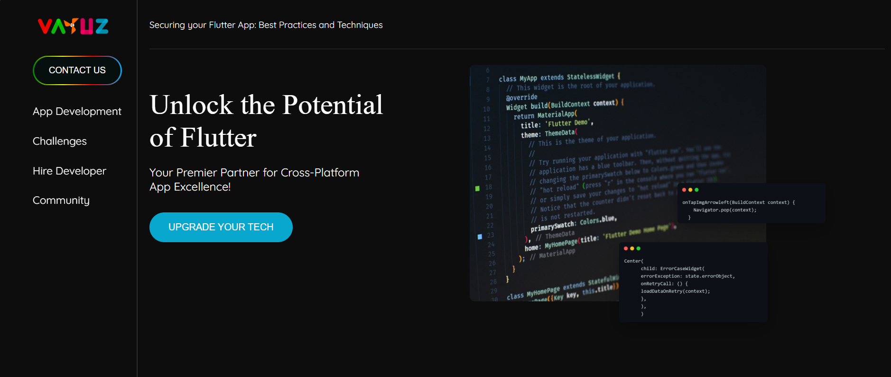
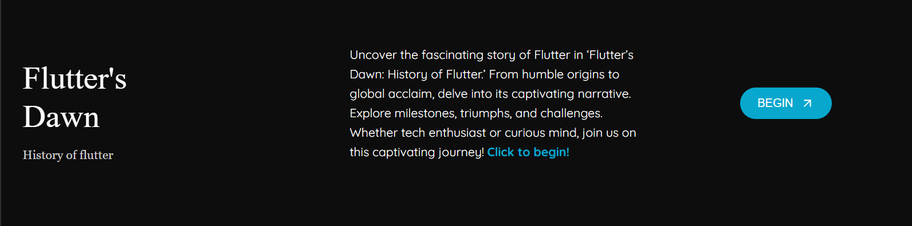
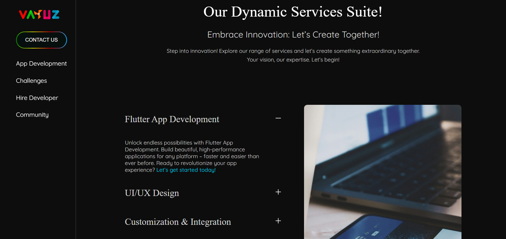
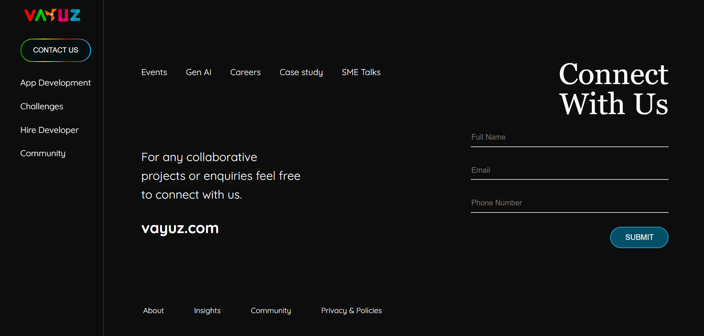

# 🚀 React UI Developer Task

Welcome to **Flutter Fusion UI**, a modern and stylish frontend built using **ReactJS** to promote your Flutter app development services. This UI is built with responsiveness, elegance, and clarity in mind to give your visitors the best experience across devices.

## 🎯 Features

- ⚡️ ReactJS with Framer Motion animations for smooth UI
- 💅 Clean, responsive layout using Flexbox and media queries
- 🎨 Dark-themed modern UI for a sleek developer aesthetic
- 🧩 Modular structure for easy scalability and updates
- 📱 Mobile-friendly and optimized

## 📸 Interface at a Glance

### ⚡️ Landing IntroPage


### 💙 Flutter Highlights


### 🛠️ Services


### 📞 ContactUs/Footer


## 🧪 How to Run

```bash
git clone https://github.com/your-username/flutter-fusion-ui.git
cd flutter-fusion-ui
npm install
npm start
```

This will launch your development server at `http://localhost:3000`.

## 💡 Folder Structure

```
src/
├── components/
│   ├── HeroSection.jsx
│   ├── FlutterDawn.jsx
│   ├── Services.jsx
│   ├── ContactForm.jsx
├── App.jsx
├── index.js
├── App.css
public/
├── hero.png
├── flutter.png
├── services.png
├── footer.png
```

## 🛠️ Technologies Used

- ReactJS
- Framer Motion
- HTML5/CSS3 (Flexbox + Media Queries)

---

Made with ~ Passion !
